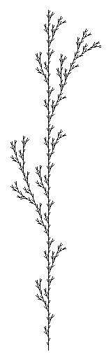
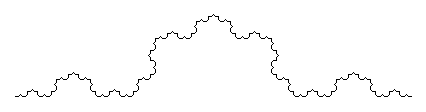

# OCamL-System

An OCaml L-System visualizer, with an ocamllex and ocamlyacc parser.

The program take as input the file that define the L-System grammar and the number of iterations, then display the result figure on a window.
An optional angle can be given to apply a rotation to the figure. 

#### Exemple :

Here an exemple of grammar file for the L-System :
```
Init : 
	F;
	 
Hered :
	F -> F [PF] F [MF] F;
	
Inter :
	F -> Line 6;
	P -> Turn 25;
	M -> Turn -25;
```
* The rule `Init` indicate the initial state of the system (here *F*)
* The rule `Hered` indicate how we compute the next state of the system (here the *F* becomes *F [PF] F [MF] F*)
* The rule `Hered` indicate how to draw the system 
	You can use the symbols **Line** to move forward and draw a line, **Move** to move forward without drawing a line and **Turn** to do a rotation
	Here *F* mean to draw a line of length 6, *P* a rotation of angle 25 and *M* a rotation of angle 25
	

If we display this L-System (*samples/plant_1.txt*) with the command `./lsys samples/plant_1.txt 4` we obtain this figure :



Another L-System (*samples/von_koch.txt*) displayed with the command `./lsys samples/von_koch.txt 4 -90` :



More informations on L-System can be found on [Wikipedia page](https://en.wikipedia.org/wiki/L-system).

## Usage

* Compilation : `make`
* Run : `./lsys filename n [angle]`
	*  *filename* : path to the grammar file of the L-System
	* *n* : number of iterations
	*  *angle* : optional, angle of rotation to apply to the figure (default value is 0)
* Delete binaries : `make uninstall`

